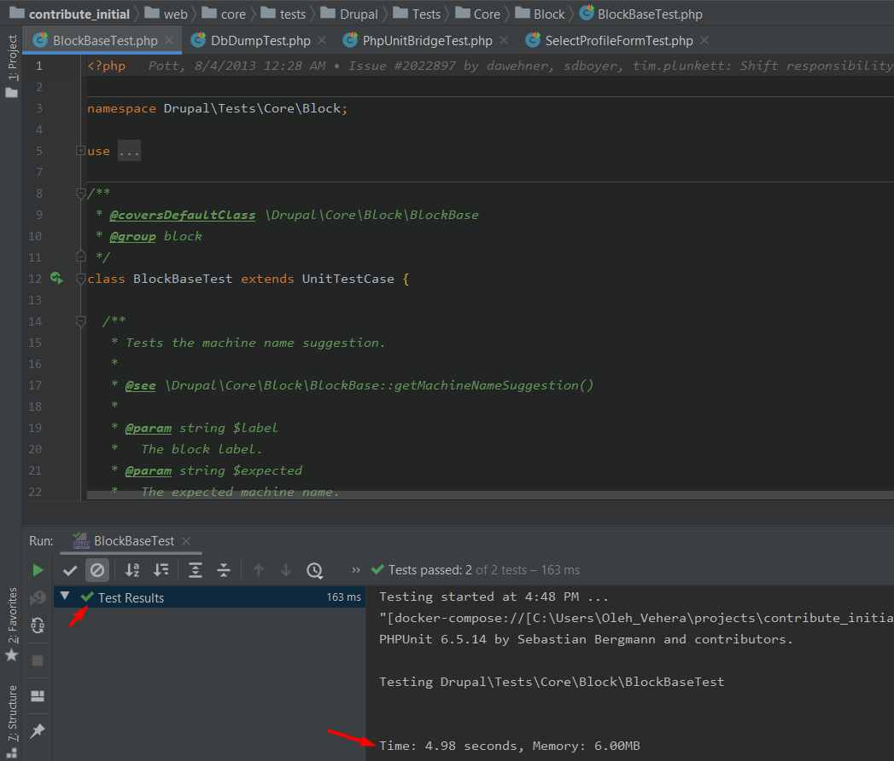

### Steps of docker-compose project configuration
 
 1. Default Docker4Drupal stack (`.env`, `docker-compose.yml` files). Can be modified, but
    for this configuration `nginx` container is required;
    https://github.com/wodby/docker4drupal
 1. Copy `docker-compose.override.yml` file from this gist to the same folder along with `docker-compose.yml` file.
 1. Clone drupal repo into web directory.
    ```shell script
    git clone --branch 8.8.x https://git.drupalcode.org/project/drupal.git web
    cd web
    ```
 1. Run containers:
    ```shell script
    docker-compose up
    ```
    Note: Always run the containers before the tests run.
 1. Install Drupal dependencies:
    ```shell script
    docker-compose exec php bash -c "cd web && composer install"
    ```
 1. Define settings.php file:
    ```shell script
    cp web/sites/default/default.settings.php web/sites/default/settings.php
    ```
 1. Set database connection:
    ```shell script
    cat >> web/sites/default/settings.php << EOL
    
    \$databases['default']['default'] = [
      'database' => getenv('DB_NAME'),
      'username' => getenv('DB_USER'),
      'password' => getenv('DB_PASSWORD'),
      'host' => getenv('DB_HOST'),
      'port' => '3306',
      'driver' => getenv('DB_DRIVER'),
    ];
    EOL
    ```

### Steps of PHPStorm configuration

1. Open project directory.
1. Go to `Settings`.
1. Define interpreter from docker-compose stack.
   
   
   
   
1. Configure the PHPUnit

   
   
   

### Setup demo site

```shell script
docker-compose exec php bash -c "cd web && drush si demo_umami --account-pass=admin -y"
```

### Test run

1. Choose one of the test from Drupal Core.
   
   Note: Nightwatch tests not covered by this configuration.
1. Launch test from the PHPStorm UI.
   
   
   
   
   
   
   
   
